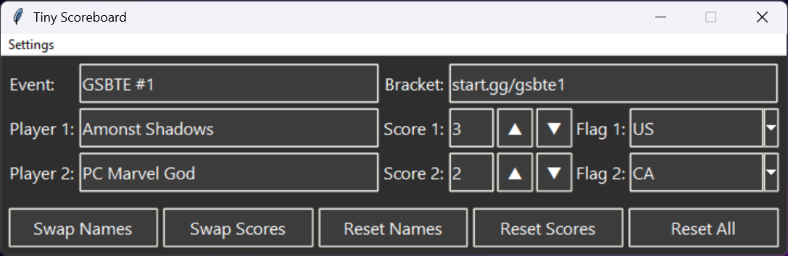
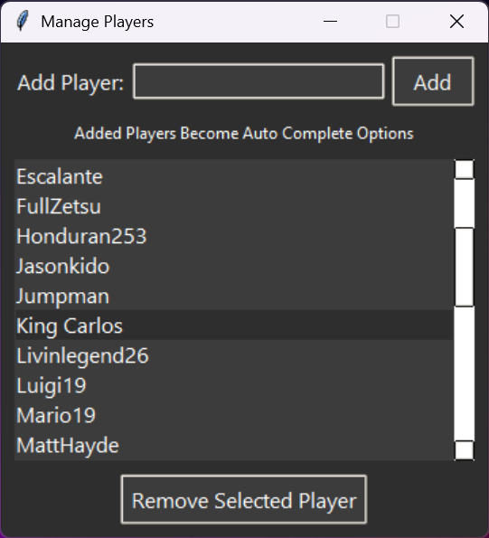
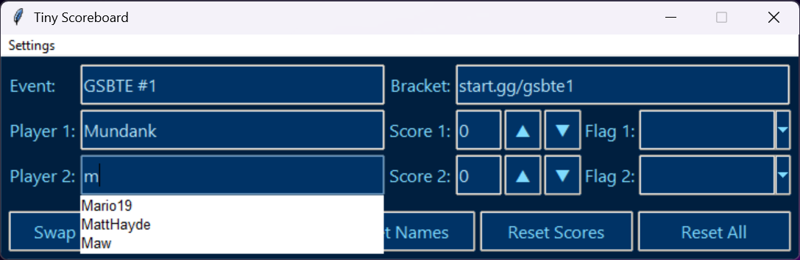

# A small gui app used for tournament stream management

[Download Current Build](https://github.com/SaldanaThomas/Tiny-Scoreboard/releases)

## Features currently include:
- Live editing
- Persistant data
- Auto complete player names
- Quick Swapping/Resetting data
- Various Themes

## Data fields are generated to .txt files which can then be linked to OBS or other streaming platforms

