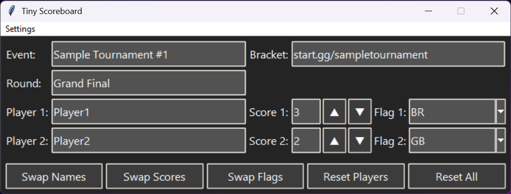
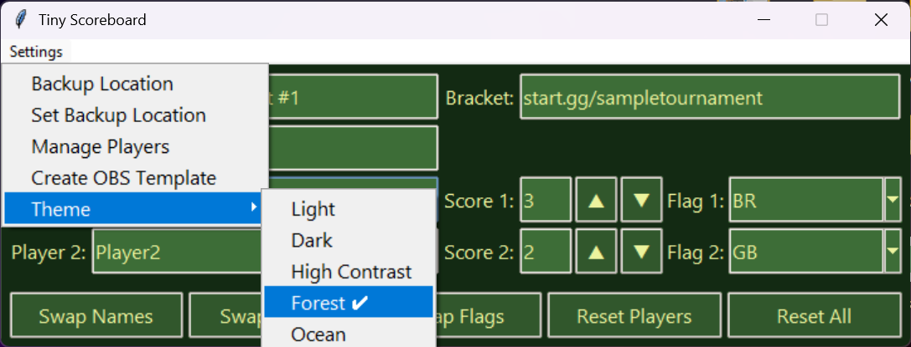

# [Download Current Build](https://github.com/SaldanaThomas/Tiny-Scoreboard/releases)

## Features currently include:
- Live editing
- Persistant data
- Auto complete player names
- Quick swapping/resetting data
- Various themes
- Flag image generation
- OBS template/importing

## Data fields are generated to .txt files which can then be linked to OBS or other streaming platforms

